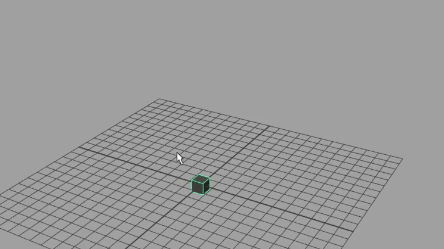
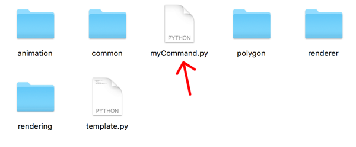
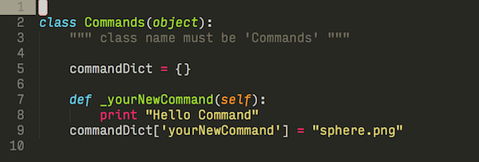

<h1 align="center">Rush</h1>

<div align="center">
<strong>TabMenu-style simple command launcher for Maya</strong>
</div>

<br>
<br>

<p align="center">
  
</p>

## Features

You can ..

* Add any commands you want
* Repeat commands by G key (Maya's default shortcut key to repeat a command)

## Installation

#### Install from zip file

1. Download [zip](https://github.com/minoue/rush/releases/download/2.2.0/rush.zip) file and extract it.
2. Move the extracted "rush" folder to your user script directory. 

   ```
    e.g. C:\Users\USER\Documents\maya\MAYA_VERSION\scripts
   ```
3. Move the 'Rush.py' in rush\plug-ins directory to your maya plug-ins directory.

   ```
    e.g C:\Users\USES\Documents\maya\MAYA_VERSION\plug-ins
   ```
4. Open maya and activate Rush.py in the plugin manager.   
    

#### Install using git

You can also use git to download the scripts.  
In your user script directory,

```
>> git clone https://github.com/minoue/rush
>> cd rush
>> git submodule update --init
```

Then, copy Rush.py to the maya plug-ins directory, and activate the plugin.

mel  

```
rush2;
```

python

```
from maya import cmds
cmds.rush2()
```

You can open the hotkey editor and assign the command to any key you want.

## How to add commands

Any commands can be added by editting/creating module files.
For example, here is the templete script in the module directory.

```python
class Commands(object):

    commandDict = {}

    def _sampleCommand(self):
        print "Hello World"
    commandDict['sampleCommand'] = "sphere.png"
    # ^ Don't forget to add the command to the dictionary.
```

To add new command, just add new method to the Command class.
Make sure to add underscore at the begging of the method name. Then, add new key/item to the commandDict. Key is the command name without underscore, and the item is an icon path(relative or absolute)

1. Create a new file.

    

2. Copy and paste the code from template file and edit your command as you want.

    

3. Save the file, go back to maya, and run reload command.

    

4. You new command should be available in the completion.

    

5. Done.

    

## Using custom module directory

You can use custom module directories.  
Create '.rushConfig' file in your home directory and add paths line by line.

eg.

```
/Users/XXXXXXX/Dropbox/dev/git/maya/extraModules
/Users/some/other/module/dir
```

## Credit

[Qt.py](https://github.com/mottosso/Qt.py) by Marcus Ottosson

<div>Icons made by <a href="http://www.flaticon.com/authors/simpleicon" title="SimpleIcon">SimpleIcon</a> from <a href="http://www.flaticon.com" title="Flaticon">www.flaticon.com</a> is licensed by <a href="http://creativecommons.org/licenses/by/3.0/" title="Creative Commons BY 3.0" target="_blank">CC 3.0 BY</a></div>
