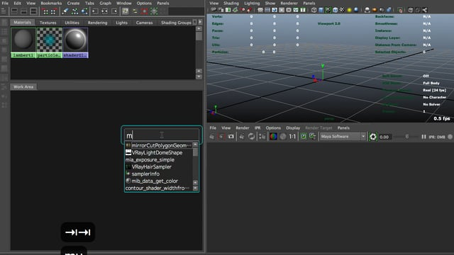

miExecutor
========


## What's this?
TabMenu-like simple command launcher for Maya

<iframe src="https://player.vimeo.com/video/144866783" width="620" height="401" frameborder="0" webkitallowfullscreen mozallowfullscreen allowfullscreen></iframe> <p><a href="https://vimeo.com/144866783">miExecutor</a> from <a href="https://vimeo.com/user4337917">michitaka inoue</a> on <a href="https://vimeo.com">Vimeo</a>.</p>

[](https://player.vimeo.com/video/144866783)

## Requirements
PySide

## Installation
https://github.com/minoue/miExecutor/archive/1.2.0.zip

Download zip file from the above link and extract it. Rename miExecutor-1.2.0 directory to miExecutor and move it to the maya user script direcotry.

Directory structure should be something like this

```python
maya
|--version
|    |--script
|    |    |--miExecutor
|    |    |    |--__init__.py
|    |    |    |--miExecutor.py
|    |    |    |--  ....
|    |    |    |--module
|    |    |    |    |--mayaNode.py
|    |    |    |    |--  ...
|    |    |    |    |--  ...
```

Try restarting Maya or run rehash command to activate the command.


## How to run
### Load

```python
from miExecutor import miExecutor
```


### If you waant to run by hotkey, 

just assgin the following command to any keys you want by Maya's hotkey editor.

```python
miExecutor.main()
```


### If you want to use tab key,
Maya usually can't use tab key as hot key but it can be overrode using Qt.

[Assigning TAB as hotkey](https://groups.google.com/forum/#!topic/python_inside_maya/U9VI7qbJGwc)


Open the pref.json file in the miExecutor directory and change "use_tab_key" option. If it's true, you can use tab key to launch the GUI. 

If it's false, tab key behavie as normal. 

You may edit userSetup.py to avoid running setup command everytime.

Be careful there is one problem if you use tab key. (explained later) 


```python
import maya.utils
def miExecLoad():
	from miExecutor import miExecutor
maya.utils.executeDeferred(miExecLoad)
```


## How to add commands
Commands can be added by editting/creating module files in the module directory.
For example, this is templete script.


```python
""" class name must be 'Commands' """
class Commands(object):

    commandDict = {}

    def _sampleCommand(self):
        print "Hello World"
    commandDict['sampleCommand'] = "sphere.png"
    # ^ Don't forget to add the command to the dictionary.
```

To add new command, just add new method.
Make sure to add underscore at the begging of method name. Method name withougt underscore is its command name.
Once you finish adding method, just add new key/item to the commandDict. Key is the command name and item is the icon path.
You can not change dictionary name. It alwasy must be 'commandDict'. Icon path can be absolute.

Once you saved the file, go back to maya and reload it.

```python
reload(miExecutor)
```

Now your new command should be available.

Commands can be organized by module and directory. If you use directory, don't forget to add __init__.py so it can be loaded as package.


## Changing style
You can change style if you want. Just change 'style' option in pref.json.

### Standard
Same as the one in the node editor.  


### Nuke
Nuke-like style.  


### NukeSquared
Nuke-like but rounded corner.  


### MediumRounded
a bit nicer looking.  


### AlfredLight
like Alfred in Mac  


## AlfredDark


## known issues
### tab behavior                   
It's useful to tab key as hotkey but this feature disable all original actions.

### Transparency
一部環境では透過処理がうまくいきません。
例えばCompositeWIndowがオフのLinux環境ではデスクトップの透過処理ができないので、透過部分が完全に黒く塗りつぶされた、あるいはファミコンがバグったようにうつります。また、Windowsでも下の画像のように透過がうまく処理されませんでした。


Macでは特に問題がなかったような気がします。

### Dropshadow
OSによってはデフォルトでウィンドウのドロップシャドウが有効になっています。
例えばWindows10ではこのような感じになります。


これはスクリプト側で治せるのかはわかりませんが、OS側から消すことができます。

[How to Disable the Drop Shadows in Windows 10](http://www.howtogeek.com/197866/how-to-disable-the-drop-shadows-in-windows-10/)

### Manual addtions.
You need to add all commands by hand...no automatic ways..


___


とまぁそんな感じで、コマンドさえわかればなんでも実行できるし、それなりに便利かなぁと思います。個人ツール用モジュールや、社内ツール用モジュールを作ったりするといいです。
