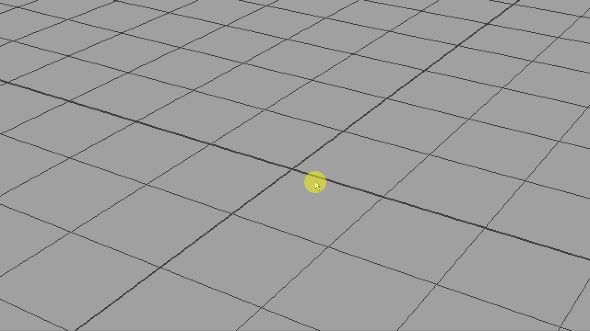
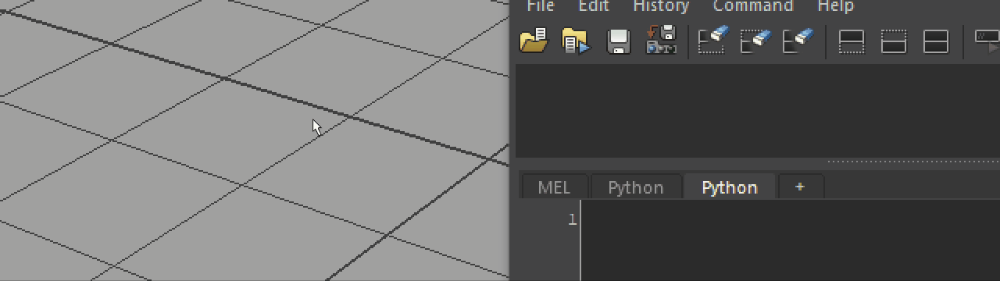
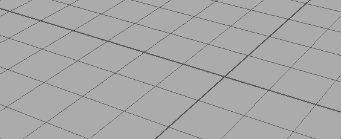

<h1 align="center">Rush</h1>

<div align="center">
<strong>TabMenu-style simple command launcher for Maya</strong>
</div>

<br>

<p align="center">
  
  
  
  

</p>

<br>
<br>



## Features

You can ..

* Add any commands you want
* Repeat commands by G key (Maya's default shortcut key to repeat a command)

## Installation

#### Install from zip file

1. Download [zip](https://github.com/minoue/rush/releases/download/2.4.1/rush.zip) file and extract it.
2. Move the extracted "rush" folder to your user script directory. 

   ```
    e.g. C:\Users\USER\Documents\maya\MAYA_VERSION\scripts
   ```
3. Move the 'Rush.py' in rush\plug-ins directory to your maya plug-ins directory.

   ```
    e.g C:\Users\USES\Documents\maya\MAYA_VERSION\plug-ins
   ```
4. Open maya and activate Rush.py in the plugin manager.   
    

#### Install using git

You can also download the scripts using git.  

```
>> cd C:\Users\YOURNAME\Documents\maya\2018\scripts
>> git clone https://github.com/minoue/rush
```

Then, copy Rush.py to the maya plug-ins directory, and activate the plugin.

## How to use

mel  

```
rush2;
```

python

```
from maya import cmds
cmds.rush2()
```

You can open the hotkey editor and assign the command to any key you want.

## How to add commands

It's easy to add your own commands. Just create new python file in the module directory or open existing module files, and add functions to them. Once you added functions, you have to add additional dict data which key is a command name(function name) and value is icon path.
Icon paths can be maya's default icon names or absolute paths if you have your own icons.

Take a look 'sample.py'

```python

commandDict = {}

def sampleCommand():
    print "Hello World"

commandDict['sampleCommand'] = "sphere.png"
```



## Command history
Use down arrow key in a black field to show recently used commands.




## Additional module directory

You can use additional module directories by adding rush.json in your maya script directory.

For example,
```
C:\Users\YOURNAME\Documents\maya\2018\scripts\rush.json
(Make sure it's script directory under the version number directory)
```

rush.json
```json
{
    "path": [
        "C:/Users/MYNAME/Dropbox/dev/maya/rushModule",
        "C:/or/wherever/you/want
    ]
}
```

## Credit

<div>Icons made by <a href="http://www.flaticon.com/authors/simpleicon" title="SimpleIcon">SimpleIcon</a> from <a href="http://www.flaticon.com" title="Flaticon">www.flaticon.com</a> is licensed by <a href="http://creativecommons.org/licenses/by/3.0/" title="Creative Commons BY 3.0" target="_blank">CC 3.0 BY</a></div>
